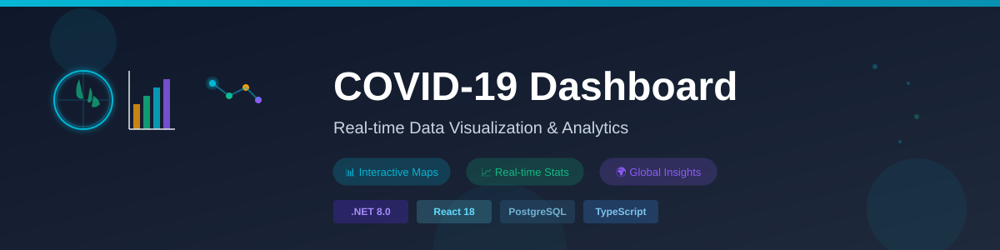
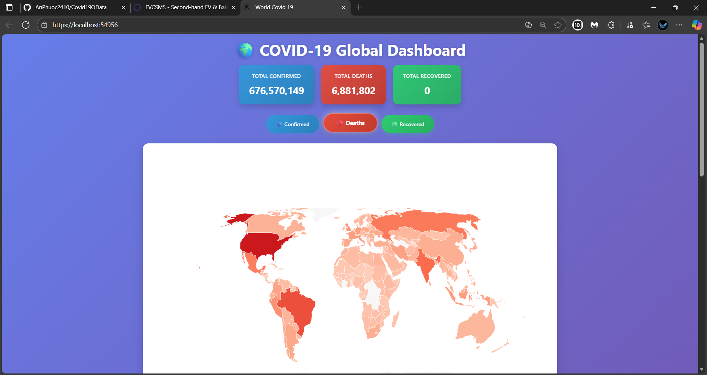
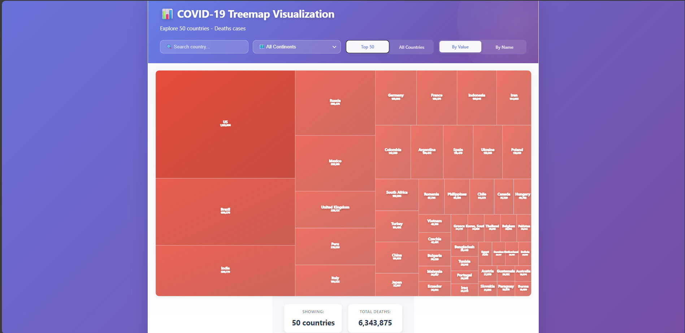

# 🌍 COVID-19 Data Visualization Dashboard

A comprehensive real-time COVID-19 data visualization and analysis platform built with modern web technologies. This full-stack application provides interactive maps, statistics, and data visualizations for tracking COVID-19 cases across countries and continents.



## 📋 Table of Contents

- [Features](#features)
- [Tech Stack](#tech-stack)
- [Prerequisites](#prerequisites)
- [Project Structure](#project-structure)
- [Setup & Installation](#setup--installation)
- [Running the Application](#running-the-application)
- [API Documentation](#api-documentation)
- [Database Schema](#database-schema)
- [Contributing](#contributing)
- [License](#license)

## ✨ Features

- **Interactive World Map**: Visualize COVID-19 data on an interactive world map with country-level granularity

- **Real-time Statistics**: Track confirmed cases, deaths, and recoveries across regions
- **Continental Filtering**: Filter and analyze data by continent
- **Data Visualization**: Charts and graphs powered by Recharts and D3

- **OData Support**: RESTful API with OData protocol for flexible data querying
- **PostgreSQL Database**: Scalable database backend with Entity Framework Core
- **Responsive UI**: Modern React-based frontend with TypeScript
- **Swagger Documentation**: Interactive API documentation with Swagger UI

## 🛠 Tech Stack

### Backend
- **Runtime**: .NET 8.0
- **Framework**: ASP.NET Core
- **ORM**: Entity Framework Core 8.0
- **Database**: PostgreSQL
- **API Protocol**: OData (Microsoft.AspNetCore.OData)
- **API Documentation**: Swagger/OpenAPI
- **CSV Processing**: CsvHelper

### Frontend
- **Library**: React 18.2.0
- **Language**: TypeScript 5.8.3
- **Build Tool**: Vite 7.1.2
- **Visualization**: Recharts 3.2.1, D3-Scale 4.0.2
- **Mapping**: React Simple Maps 3.0.0
- **Linting**: ESLint 9.33.0

## 📦 Prerequisites

### Required
- **.NET 8.0 SDK** or later
- **Node.js 18+** and **npm/yarn**
- **PostgreSQL 12+**
- **Git**

### Optional
- **Visual Studio 2022** or **VS Code** (with C# extension)
- **pgAdmin** (PostgreSQL management tool)

## 📁 Project Structure

```
Covid19/
├── Covid19.Server/                    # ASP.NET Core Backend
│   ├── Controllers/                   # API endpoints
│   │   ├── CovidConfirmedController.cs
│   │   ├── CovidDeathController.cs
│   │   ├── CovidRecoverController.cs
│   │   ├── DailyReportsController.cs
│   │   └── SeedController.cs
│   ├── Models/                        # Data models
│   │   ├── CovidConfirmedCase.cs
│   │   ├── CovidDeathCase.cs
│   │   ├── CovidRecoverCase.cs
│   │   ├── CovidDailyReport.cs
│   │   └── CovidDataPoint.cs
│   ├── Services/                      # Business logic
│   │   ├── CovidConfirmService.cs
│   │   ├── CovidDeathService.cs
│   │   ├── CovidRecoverService.cs
│   │   └── DailyReportService.cs
│   ├── Migrations/                    # Database migrations
│   ├── ApplicationDbContext.cs        # EF Core context
│   ├── Program.cs                     # Application startup
│   └── appsettings.json              # Configuration
│
├── covid19.client/                    # React Frontend
│   ├── src/
│   │   ├── App.tsx                   # Main component
│   │   ├── App.css                   # Styles
│   │   ├── covid.ts                  # API service
│   │   ├── main.tsx                  # Entry point
│   │   └── assets/                   # Static assets
│   ├── public/
│   │   ├── map.json                  # GeoJSON data
│   │   └── dashboard-header.svg      # Dashboard header image
│   ├── package.json                  # Dependencies
│   ├── vite.config.ts               # Vite configuration
│   └── tsconfig.json                # TypeScript configuration
│
└── Covid19.sln                        # Solution file
```

## 🚀 Setup & Installation

### Step 1: Clone the Repository

```bash
git clone https://github.com/AnPhuoc2410/Covid19OData.git
cd Covid19
```

### Step 2: Backend Setup

#### 2.1 Configure PostgreSQL Database

Create a PostgreSQL database:

```bash
# Using psql (PostgreSQL command line)
psql -U postgres -c "CREATE DATABASE covid19_db;"
```

Or using pgAdmin GUI:
1. Open pgAdmin
2. Right-click "Databases" → Create → Database
3. Name it `covid19_db` and create

#### 2.2 Configure Connection String

Edit `Covid19.Server/appsettings.json`:

```json
{
  "ConnectionStrings": {
    "DefaultConnection": "Host=localhost;Port=5432;Database=covid19_db;Username=postgres;Password=YOUR_PASSWORD"
  },
  "Logging": {
    "LogLevel": {
      "Default": "Information",
      "Microsoft.AspNetCore": "Warning"
    }
  },
  "AllowedHosts": "*"
}
```

**Update** `YOUR_PASSWORD` with your PostgreSQL password.

#### 2.3 Restore NuGet Packages

```bash
cd Covid19.Server
dotnet restore
```

#### 2.4 Apply Database Migrations

```bash
dotnet ef database update
```

This will:
- Create all database tables
- Set up the schema
- Initialize the database structure

### Step 3: Frontend Setup

#### 3.1 Install Dependencies

```bash
cd covid19.client
npm install
```

#### 3.2 Generate HTTPS Certificate (for local development)

Run this command in the `covid19.client` directory:

```bash
npm run dev
```

This will automatically generate the required HTTPS certificate for local development.

## 🏃 Running the Application

### Option 1: Run Both Server and Client Together (Recommended)

From the root `Covid19.Server` directory:

```bash
# Terminal 1: Start the backend
cd Covid19.Server
dotnet run

# Output should show:
# Now listening on: https://localhost:5001
# Application started. Press Ctrl+C to shut down.
```

In another terminal or automatically with SPA proxy:

```bash
# Terminal 2: Start the frontend (if not auto-started)
cd covid19.client
npm run dev
```

The application will be available at:
- **Frontend**: `https://localhost:5173` (Vite dev server)
- **Backend API**: `https://localhost:5001`
- **Swagger UI**: `https://localhost:5001/swagger`

### Option 2: Run Separately

**Backend:**
```bash
cd Covid19.Server
dotnet run
```

**Frontend:**
```bash
cd covid19.client
npm run dev
```

### Option 3: Production Build

**Frontend Build:**
```bash
cd covid19.client
npm run build
npm run preview
```

**Backend Production:**
```bash
cd Covid19.Server
dotnet build -c Release
dotnet publish -c Release -o ./publish
```

## 📡 API Documentation

### Base URL
- Development: `https://localhost:5001`
- Production: `https://your-domain.com`

### OData Endpoints

The API supports OData query syntax for flexible data retrieval:

#### COVID Confirmed Cases
```
GET /odata/CovidConfirmed?$filter=CountryRegion eq 'US'&$select=Date,Confirmed
GET /odata/CovidConfirmed?$orderby=Date desc&$top=10
```

#### COVID Deaths
```
GET /odata/CovidDeath?$filter=CountryRegion eq 'Italy'
```

#### COVID Recoveries
```
GET /odata/CovidRecover?$expand=Country
```

#### Daily Reports
```
GET /odata/CovidDailyReports?$filter=Date gt 2020-01-01
```

### OData Query Options

- `$select`: Select specific columns
- `$filter`: Filter data by conditions
- `$orderby`: Sort results
- `$top`: Limit number of results
- `$skip`: Skip number of results
- `$expand`: Include related data
- `$count`: Get total count

### Example Queries

Get confirmed cases for a specific country:
```
https://localhost:5001/odata/CovidConfirmed?$filter=CountryRegion eq 'China'&$select=Date,Confirmed,Lat,Long
```

Get top 100 highest confirmed cases:
```
https://localhost:5001/odata/CovidConfirmed?$orderby=Confirmed desc&$top=100
```

Get records between dates:
```
https://localhost:5001/odata/CovidConfirmed?$filter=Date ge 2020-03-01 and Date le 2020-03-31
```

### Swagger UI

Access interactive API documentation at:
```
https://localhost:5001/swagger
```

## 💾 Database Schema

### Tables

#### CovidConfirmedCase
- `Id` (GUID) - Primary Key
- `ProvinceState` (string, nullable)
- `CountryRegion` (string)
- `Lat` (double, nullable) - Latitude
- `Long` (double, nullable) - Longitude
- `Date` (datetime)
- `Confirmed` (int) - Number of confirmed cases

#### CovidDeathCase
- `Id` (GUID) - Primary Key
- `ProvinceState` (string, nullable)
- `CountryRegion` (string)
- `Lat` (double, nullable)
- `Long` (double, nullable)
- `Date` (datetime)
- `Deaths` (int)

#### CovidRecoverCase
- `Id` (GUID) - Primary Key
- `ProvinceState` (string, nullable)
- `CountryRegion` (string)
- `Lat` (double, nullable)
- `Long` (double, nullable)
- `Date` (datetime)
- `Recovered` (int)

#### CovidDailyReport
- `Id` (GUID) - Primary Key
- `Date` (datetime)
- `CountryRegion` (string)
- `LastUpdate` (datetime)

#### CovidDataPoint
- `Id` (GUID) - Primary Key
- `Timestamp` (datetime)
- `Value` (double)
- `Metric` (string)

## 🔧 Development

### Frontend Development

```bash
cd covid19.client

# Development server with hot reload
npm run dev

# Build for production
npm run build

# Run linter
npm run lint

# Preview production build
npm run preview
```

### Backend Development

```bash
cd Covid19.Server

# Run in development mode
dotnet run

# Watch mode (rebuilds on file changes)
dotnet watch run

# Build only
dotnet build

# Run tests (if available)
dotnet test
```

### Database Migrations

```bash
# Create a new migration
dotnet ef migrations add MigrationName

# Apply migrations
dotnet ef database update

# Remove last migration
dotnet ef migrations remove
```

## 🐛 Troubleshooting

### Port Already in Use
```bash
# Windows - Find and kill process on port 5001
netstat -ano | findstr :5001
taskkill /PID <PID> /F

# macOS/Linux
lsof -i :5001
kill -9 <PID>
```

### Database Connection Failed
- Verify PostgreSQL is running
- Check connection string in `appsettings.json`
- Verify database exists: `psql -U postgres -l`
- Check PostgreSQL user permissions

### CORS Issues
- Ensure CORS policy is configured in `Program.cs`
- Check that frontend and backend URLs are correctly set

### Node Modules Issues
```bash
cd covid19.client
rm -r node_modules package-lock.json
npm install
```

### Certificate Issues (Windows)
```bash
# Regenerate HTTPS certificate
dotnet dev-certs https --clean
dotnet dev-certs https --trust
```

## 📚 Additional Resources

- [ASP.NET Core Documentation](https://docs.microsoft.com/aspnet/core)
- [React Documentation](https://react.dev)
- [OData v4 Documentation](https://docs.oasis-open.org/odata/odata/v4.01/odata-v4.01-part1-protocol.html)
- [Entity Framework Core](https://docs.microsoft.com/en-us/ef/core)
- [PostgreSQL Documentation](https://www.postgresql.org/docs)

## 📄 License

This project is licensed under the MIT License - see the [LICENSE.txt](LICENSE.txt) file for details.

## 👤 Author

- **An Phuoc** - [@AnPhuoc2410](https://github.com/AnPhuoc2410)

## 🙏 Acknowledgments

- COVID-19 Data source
- React community
- ASP.NET Core team
- Open source contributors

---

**Last Updated**: November 2025  
**Version**: 1.0.0  
**Status**: The project has been suspended.